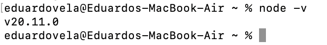
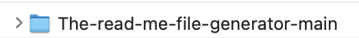
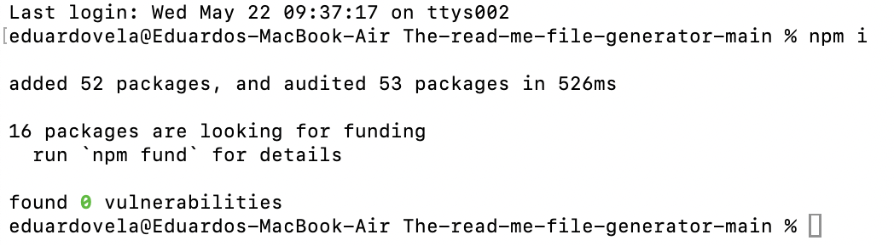
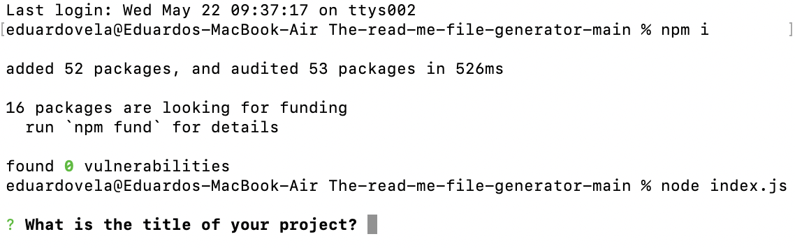

# The read me file generator

## Description

The reason I built this project was to understand how to use npm to install third party libraries, how to use node to run a JavaScript file, and how to create and write information to a markdown file. This project allows you to generate a readme.md file for one of your projects, by entering its information into the read me file generator. Besides generating a readme.md file, this project will also generate a badge with the name of the license your project uses, and, in the license section of the readme.md file, it will place a link to a website where you can obtain more information about your project's license.

## Table of Contents

1. [Installation](#installation)
2. [Usage](#usage)
3. [Credits](#credits)
4. [License](#license)

## Installation

1. In order to use this project, first you must have Node.js installed in your system. To install Node.js in your system, click on the following link and follow its installation instructions, to install it in your system: https://nodejs.org/en To check if Node.js was successfully installed, run the following command on your preferred terminal or console: “node -v” If it was installed successfully, the terminal or console should return a similar result to this one:

   

2. If you already have Node.js installed, or once you have it installed, you must now download the source code of the project, by clicking on the green “Code” button found on the main page of the project’s GitHub repository, and selecting the download ZIP option. The following folder will be downloaded as a result:

   

3. Then using the terminal or a console of your preference, you now must navigate to the project’s folder location, then you must execute the following commands to initialize it. First you must execute the “npm i” command, then the “node index.js” command to finally run it. You should see the following in your terminal or console as a result:

   - **"npm i" command:**
     
   - **"node index.js" command:**
     

4. Congratulations! The project was successfully installed in your computer system. To keep using it, open your terminal or console and navigate to the project’s folder location, and run the “node index.js” command.

## Usage

To learn how to use this project, you can click on the following link to see a walkthrough video that explains how to use it: https://drive.google.com/file/d/1vMKk8cRP7NDm35JFO49EiZc0cYK0S5Br/view?usp=sharing

## Credits

- **To replace the empty spaces of a string with dashes:** SheCodes. (n.d.). [JavaScript] - How to Replace Spaces with Dashes in a JavaScript String. [JavaScript] - How to Replace Spaces with Dashes in a JavaScript String | SheCodes. https://www.shecodes.io/athena/10237-how-to-replace-spaces-with-dashes-in-a-javascript-string#google_vignette

- **To create shields.io badges:** Shields.oi. (n.d.). Static Badge. Static Badge | Shields.io. https://shields.io/badges

- **To get the information of most open source licenses:** Open Source Initiative. (n.d.). OSI Approved Licenses. Licenses - Open Source Initiative. https://opensource.org/licenses/

- **To get the information of the Creative Commons Zero v1.0 Universal License:** Creative Commons. (n.d.). CC0 1.0 LEGAL CODE. CC0 1.0 Legal Code | CC0 1.0 Universal | Creative Commons. https://creativecommons.org/publicdomain/zero/1.0/legalcode.en

## License

This project is under the MIT license.
